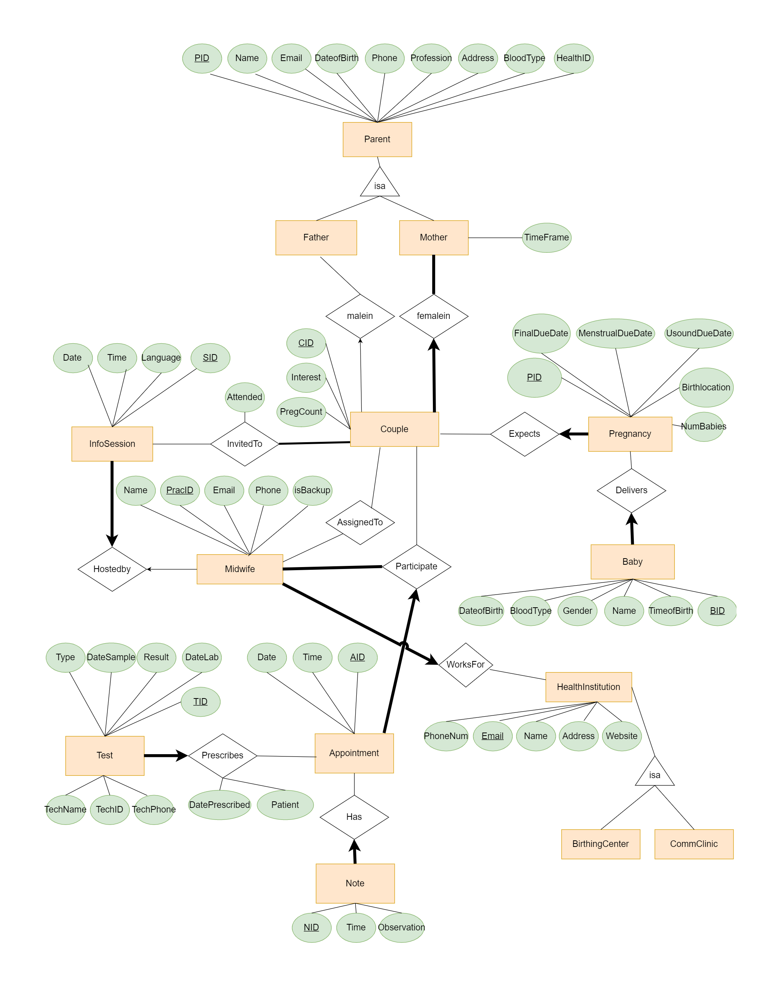

# Database-Application-for-Midwifes
Created an app that is connected to a SQL database for COMP-421

Designed an entity-relationship model and then created the database using DB2. A UI was then created in JAVA. 

ER

